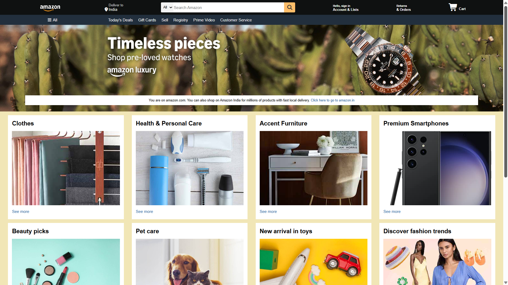

This is a simple **Amazon homepage clone** built using **HTML and CSS**.

## 🚀 Live Demo
[Click here to view the project](https://krpranav7.github.io/Amazon_clone/)

## 📌 Features
- Amazon-style navbar
- Search bar
- Hero section
- Product category boxes
- Footer section
- Clean layout using HTML and CSS

## 🛠️ Tech Stack
- HTML5
- CSS3
- Font Awesome

## 📂 Project Structure
```bash
Amazon_clone/
│── index.html
│── style.css
│── README.md
│
├── assets/
│   │── amazon_logo.png
│   │── hero_section.jpg
│   │── box1_image.jpg
│   │── box2_image.jpg
│   │── box3_image.jpg
│   │── box4_image.jpg
│   │── box5_image.jpg
│   │── box6_image.jpg
│   │── box7_image.jpg
│   │── box8_image.jpg
│   │── screenshot.png
│   │── screenshot2.png

## 📷 Preview
<p align="center">
  
</p>


## 📖 What I Learned
While building this project, I practiced:
- HTML structure
- CSS styling
- Flexbox basics
- Background images
- Layout building

## 📌 Future Improvements
- Make the website responsive for mobile
- Add hover effects and animations
- Improve navbar and footer design

## 👨‍💻 Author
Pranav Kumar